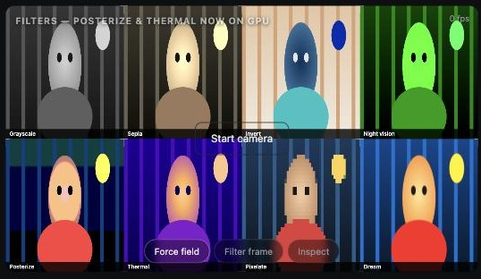

<div align="center">

# PhotoShoot

**Real-time hand tracking in the browser — no install, no backend.**
Started as a finger-counting demo, grew into a two-hand gesture that
stacks live video filters over the feed.

[](https://ai.google.dev/edge/mediapipe/solutions/vision/hand_landmarker)
[](#)
[](#)

</div>

```bash
python3 -m http.server 5173
open http://localhost:5173
```

Runs entirely client-side: MediaPipe (WASM/GPU) does 21-point hand landmark
detection; everything downstream — gesture recognition, physics, filters —
is plain canvas/JS.

## What it does

<div align="center">

<br><sub>Filter frame — 7 stacked regions, live hand skeleton overlay, 30fps</sub>
</div>

<div align="center">

<br><sub>The eight filters in the cycle — Grayscale through Dream</sub>
</div>

### Hand + finger detection
[`app.js`](app.js) — tracks up to 2 hands, reports which fingers are up, and
recognizes a handful of static gestures (fist, open palm, peace, pointing,
thumbs up, pinch, OK, rock, call-me). Finger state is computed from landmark
distances rather than fixed angles, so it holds up across hand rotation.

### Filter frame
[`filters.js`](filters.js) — hold an L-shape with both hands (index out,
middle curled) and the rectangle between them gets a live filter. Drop your
hands and it stays in place; frame again and a new rectangle stacks on top
with the next filter in the cycle, so the frame fills up with regions
instead of replacing the last one. In Filter Frame mode each tracked hand
gets a small readout at the wrist, so you can see what the gesture check
disagrees with instead of guessing: **L ✓ / L ✗** with two hands, **🔫 /
🔫 armed / 🔫 ✗** with one.

### Dismiss gesture
Point a one-hand "finger gun" (index out, everything else curled, thumb
cocked up) at the screen and drop your thumb like pulling a trigger — it
pops the last frame off, the same as the Undo button. Deliberately gated
to exactly one hand in frame: with two hands present this logic doesn't
run at all, so it can never be confused with the two-hand framing
gesture above, even if one hand happens to be gun-shaped while the other
is still framing. The trigger itself is an edge detector (thumb was up,
now isn't), not a level check, so holding the fired pose doesn't repeat-
fire, and simply having your thumb down as part of some other gesture
(an open palm, say) doesn't count — only a thumb that was up while
gun-posed and then drops.

## The interesting bugs

**Deployed, but the gesture never fired.** The first version of the
gesture check required index up *and* middle, ring, *and* pinky all fully
curled, on both hands, at once. That's much stricter than it sounds: ring
and pinky rarely curl all the way during a natural "L," and they're also
the two fingers MediaPipe reads least reliably (most self-occluded). Hand
tracking itself worked fine — the compound condition just almost never
passed. Fixed by dropping to the two signals that actually matter: index
up, middle down. Ring/pinky aren't checked at all anymore. The live L ✓/✗
badge exists specifically so this class of "tracking works, gesture
doesn't" bug is visible on-screen instead of invisible.

**The 12-stamp performance bug.**

Stacking filter regions meant running up to 12 of them per frame. Grayscale
and the other native `ctx.filter` strings cost nothing, but Posterize and
Thermal were originally per-pixel JS passes (`getImageData` → mutate →
`putImageData`) — correct, but **28ms for 12 stamps**, well past the 16.7ms
budget for 60fps.

The fix wasn't optimizing the pixel loop (it already ran on a downscaled
copy) — it was that `getImageData`/`putImageData` round-trips the GPU-backed
canvas through the CPU, and that cost scales with call count, not pixel
count. Rewriting both as SVG filters (`feComponentTransfer` for posterize,
a luminance matrix + color ramp for thermal) referenced via
`ctx.filter = "url(#id)"` keeps the whole pass on the GPU:

| | before | after |
|---|---|---|
| 12 stamps, Posterize | 28.6ms | 0.06ms (GPU work included: ~2.4ms) |
| 12 stamps, mixed filters | 14.3ms | ~2.4ms |

A second, smaller find: resizing the scratch `<canvas>` (`canvas.width = …`)
once per filter per frame — needed for the pixelate effect — reallocates the
backing store and alone cost ~30ms across 12 stamps. Allocating it once at
startup instead of per-call fixed it.

**Live on Vercel, but only one filter visibly worked.** All 7 non-blur
filters silently did nothing after deploying — Canvas2D `ctx.filter` can
accept `grayscale()`, `sepia()`, `invert()`, `hue-rotate()`, and
`url(#svg-filter)` without erroring, yet some Safari versions never
actually apply them, while `blur()` has been reliably supported for far
longer. The bug reads as "it's live but broken" when it's really "half the
filter functions Canvas2D accepts are silently no-ops on this browser" —
nothing in the deployed source was different from what worked locally.

Fixed with a runtime capability probe: draw one pixel through the filter,
check whether the color actually changed, and fall back to the manual
per-channel math this project used before the GPU rewrite. Verified by
monkey-patching `ctx.filter` into a silent no-op (the exact failure being
hypothesized) and confirming all 6 affected filters still visibly changed
the image.

First attempt at the probe had two bugs worth noting, both found before
shipping by actually testing the fix rather than trusting the design:

- It tested every filter with one representative string (`invert(1)`)
  standing in for all of them. A browser can support a simple function
  while failing a long compound chain like Night Vision's, or the reverse —
  so each filter's own exact string needs its own probe, not a proxy.
- It tested Posterize with pure red, but posterize's discrete steps happen
  to map 255 back to 255 — so "the filter ran and snapped to the nearest
  step" and "the filter never ran" looked identical, and the probe reported
  native support as broken even in Chromium, where it demonstrably isn't.
  Fixed by probing with a color that isn't sitting on a quantization
  boundary, shared across every filter's probe.

The first shipped fallback also over-corrected on quality: it rendered at
a 140px-wide working resolution to stay fast, which was comfortably within
budget (2.95ms for 12 stacked regions) but visibly softer than the native
path — exactly the kind of regression that's easy to miss when you're
focused on "does it work at all" rather than "does it still look good."
Raised to 240px after re-measuring the worst case (12 simultaneous
fallback regions) at each step: 320px hit 13.2ms, too close to the 16.7ms
budget once real hand-tracking cost is added back in; 240px landed at
4.76ms with clearly smoother gradients, a safer margin on exactly the
slower devices that need this path at all.

**Worked on a real phone, but stretching the frame wider didn't resize
it.** The two-hand gesture tracked fine; the rectangle itself just
wouldn't grow past a certain point when spreading hands apart to enlarge
it. My first theory was wrong and worth recording as a reasoning check:
the rectangle's corners are built from a min/max bound over each hand's
thumb *and* index tip, and I initially suspected the thumb (no longer
required to stay extended once the gesture check was relaxed) was
anchoring the box inward. That doesn't hold up mathematically — a min/max
bound over more points can only match or exceed the same bound over
fewer, never shrink it, so dropping the thumb point couldn't be what was
making the box *too small*. Caught this by proving it out numerically
before shipping the wrong fix, not by assuming the first plausible story.

The real cause: resizing was gated on the *exact* per-frame finger pose
(index up, middle curled, both hands) that starts the gesture, not just
on both hands being visible. Spreading your arms wider to enlarge the
frame changes your hands' angle to the camera a lot — and that's exactly
when the per-finger curl reading gets noisiest. A single misread frame
mid-stretch froze the rectangle right where it was, which reads as
"expanding doesn't work" even though tracking itself looked fine. Fixed
by decoupling the two: starting the gesture still requires the strict
pose, sustained for several frames, so it can't trigger by accident —
but once started, resizing only needs both hands to still be visible,
and finishing ("drop your hands," per the on-screen instruction) now
means hands actually leaving the frame, not the pose merely lapsing for
a moment. Verified with brief one-hand occlusion mid-resize too: it holds
the rectangle steady and resumes without stamping prematurely.

**Phone testing turned up two UI bugs with the same root cause: nothing
had been tried on a touch screen before.** Undo (`Z`) and Clear (`Space`)
are keyboard shortcuts with no on-screen equivalent — a phone user could
stack filters but never remove or clear them without reloading the page.
Added matching touch buttons. Second: once those buttons existed, the
control row could wrap to two lines on a narrow phone, and the fixed
16:9 stage was short enough that the wrapped row visually collided with
the centered "Start camera" button — worse, since the controls paint on
top of it in the DOM, a tap aimed at "Start camera" could land on
"Inspect" instead. Fixed by giving the stage more vertical room (a taller
aspect ratio) below 760px, so both rows have space regardless of how the
controls wrap.

**Resizing stopped when you let go, but didn't stop *when* you let go.**
After fixing the "won't drag" bug, a follow-up report came in that felt
contradictory at first: now it wouldn't stop dragging after you deliberately
let go of the L-shape, as long as both hands stayed anywhere in frame. Both
were real, and the fix for one had caused the other — resizing had been
keyed on "both hands visible" with no time limit, when what was needed was
"both hands visible, but only for a short grace window after the exact pose
was last seen." A `POSE_GRACE_FRAMES` counter resets to a few frames every
time the strict pose is read correctly and ticks down otherwise; resizing
rides through it, same as before, but letting go for real now freezes the
rectangle within ~2 frames (~70ms) instead of continuing indefinitely.

**The CPU fallback's quality ceiling wasn't actually about pixel count.**
Asked to make the fallback filters as high-quality as possible, the first
instinct was to just raise its 240px working resolution — but that
reintroduces the exact risk the number had been tuned against (12 stacked
regions at 320px had measured 13.2ms, too close to budget). Benchmarking
the *real* code path instead of a simplified one found something that
didn't match that assumption at all: dropping the working resolution to
150px while *keeping the scratch buffer at a fixed 480px* still cost
13–14ms for 12 regions — barely better than before, even though it was
processing far fewer pixels.

Isolated by resizing the same scratch buffer to different sizes while
reading back the identical small sub-region each time: `getImageData` /
`putImageData` cost scales with the canvas's *allocated* size, not the
sub-region actually requested. A buffer kept oversized "just in case" taxes
every call into it, including the common case of one small filtered
region. The fix wasn't a smaller resolution — it was resizing the scratch
buffer itself, once per frame (never per stamp — a bare `canvas.width = …`
assignment is the expensive case this project already hit once, at ~2.5ms,
when it happened 12 times in a frame), to match what that frame actually
needs.

With that fixed, the quality/performance trade-off this project kept
re-litigating mostly stopped existing: a single filtered region — even
full-screen — now renders at **full native resolution, zero downscaling**
(~2.7ms), and the worst case of 12 simultaneous fallback regions, which
used to force a hard choice between 150px-and-fast or 320px-and-risky,
now renders at ~400px and **3.8ms**. The resolution still adapts
(`budget / √active-region-count`) so pathological cases degrade
gracefully instead of being pre-emptively capped for a scenario that
rarely happens.

## Known gaps

- Gesture thresholds are hand-tuned heuristics, not learned — works, but is
  the obvious next thing to replace with a small trained classifier on
  landmark features.
- No persistent capture/gallery yet — this was the tracking + effects layer,
  the photo-booth flow (countdown, shutter, gallery) comes next.
