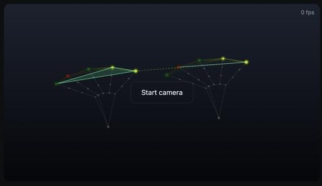
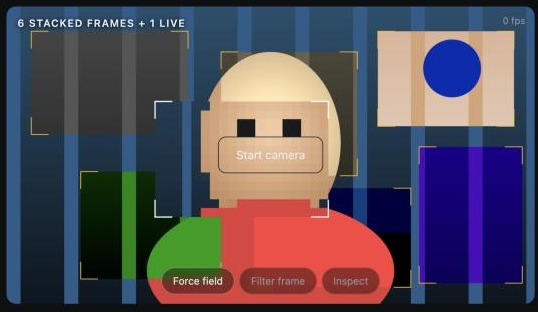
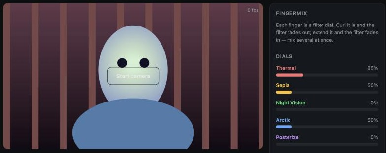

<div align="center">

# HandTrack

**Computer vision & ML projects built around real-time hand tracking.**
No installs, no backend — everything runs live in the browser off the webcam.

[](https://github.com/asqararslonov/HandTrack/commits/main)
[](LICENSE)
[](#)
[](https://ai.google.dev/edge/mediapipe)
[](#)



</div>

<br>

## Projects

<table>
<tr>
<td width="220"></td>
<td>

### [PhotoShoot](PhotoShoot/)
Real-time hand & finger tracking (MediaPipe) and a two-hand "director's
frame" gesture that stacks live video filters over the feed.

**[Read the full writeup →](PhotoShoot/README.md)**

</td>
</tr>
<tr>
<td width="220"></td>
<td>

### [Constellation](Constellation/)
Your hands as a live network: every joint is a node, fingertips wire
together into a mesh, and whichever fingers you raise close into a filled
shape — a triangle at 3 fingers, a pentagon at 5. Two hands bridge across
matching fingertips.

**[Read the full writeup →](Constellation/README.md)**

</td>
</tr>
<tr>
<td width="220"></td>
<td>

### [FingerMix](FingerMix/)
Each finger is a filter dial — curl it in and the filter fades out, extend
it and it fades in. Thumb is Thermal, index Sepia, middle Night Vision,
ring Arctic, pinky Posterize. Open several fingers at once and the filters
blend live instead of switching one at a time.

**[Read the full writeup →](FingerMix/README.md)**

</td>
</tr>
</table>

More projects get added here as they're finished — each one gets its own
folder and its own README.

## Why this repo exists

Most of this starts as a hobby project, but it doubles as a running build
log: what got built, what broke, and how it got fixed. Each project's README
covers the non-obvious engineering decisions, not just a feature list —
performance bugs, tracking quirks, the stuff that's actually worth writing
down.

## Stack notes

No build step by default — plain HTML/CSS/JS served statically, so any
project can be opened by just running a local server:

```bash
cd <project> && python3 -m http.server 5173
```

Heavier ML work (custom-trained models, Python pipelines) gets its own
`requirements.txt` / `package.json` inside that project's folder as needed.

## License

[MIT](LICENSE) — do whatever you want with it.
